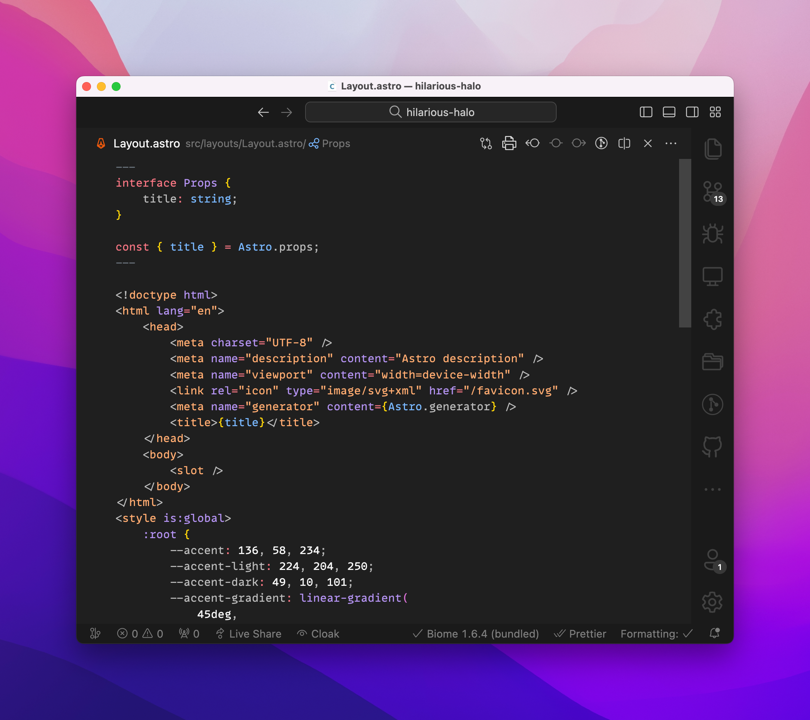
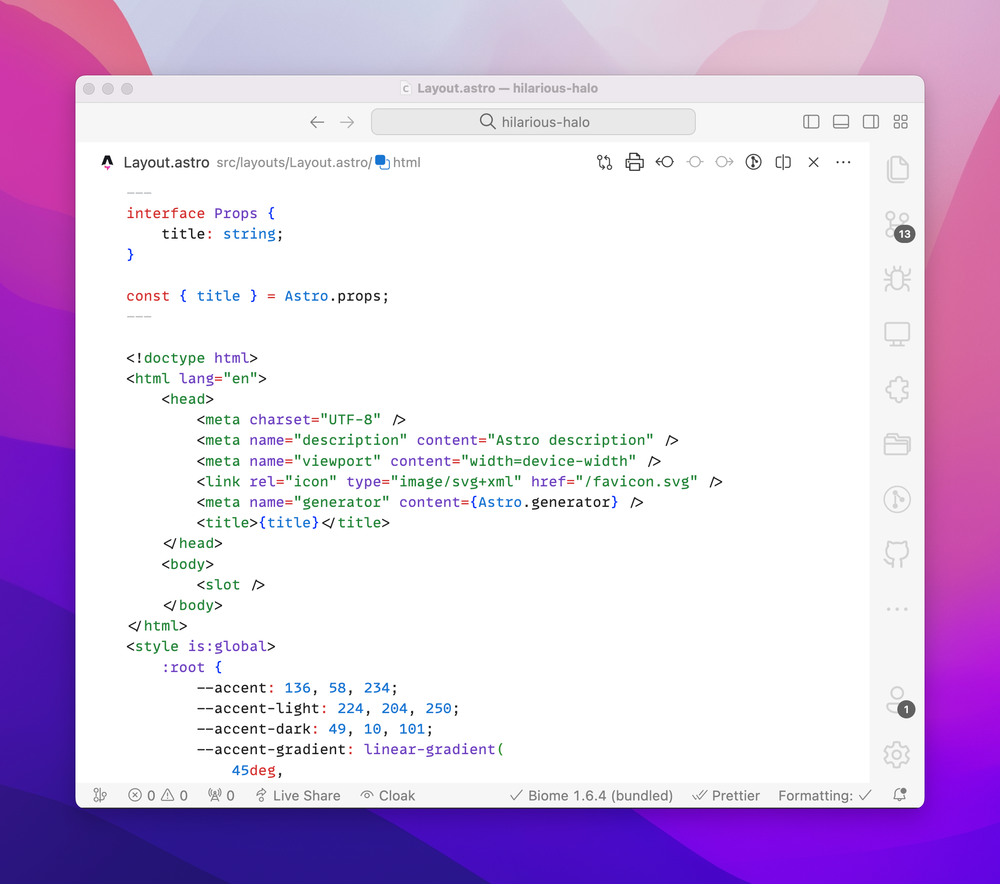

<h3 align="center">

</h3>

<p align="center">
	
	
</p>

## Usage

### Install via Zed Extensions

1. Open Zed.
2. `cmd+shift+p` and select _zed: extensions_
3. Select _Min Theme_ and Install
4. Select your Min Theme variant in the dropdown shown after hitting ( `cmd+k`, `cmd+t` )

## Development

### Use `whiskers` to Render Theme from `zed.tera` Template

<details>

1. Install [Rust](https://www.rust-lang.org/tools/install)
2. Install [`whiskers`](https://crates.io/crates/catppuccin-whiskers) (>= 2.0.2)

   ```bash
   # from source (preferred)
   cargo install --git https://github.com/catppuccin/toolbox catppuccin-whiskers
   ```

3. Test and check changes against current `themes/catppuccin.json` theme

   ```bash
   # returns nothing if no differences found
   whiskers zed.tera -o json --check themes/catppuccin.json
   ```

4. Generate the zed extension theme file

   ```bash
   whiskers zed.tera -o json
   ```

5. (Optional) Generate the accent you want (default is `mauve`)

   ```bash
   whiskers zed.tera -o json --overrides '{"accent": "rosewater"}'
   ```

6. Refresh Zed to load changes after ensuring local extension install

</details>

### Test Zed Extension Theme Locally

<details>

From [Zed Extensions docs](https://github.com/zed-industries/extensions/blob/c891c83f2fed6e388184ac87e7966b150680a3d1/AUTHORING_EXTENSIONS.md#testing-your-extension-locally):

1. Install/copy this project into `~/Library/Application\ Support/Zed/extensions/installed/` directory

   ```bash
   ln -sf $(pwd) ~/Library/Application\ Support/Zed/extensions/installed/
   ```

2. Refresh theme extension using: `cmd+shift+p` > `zed: reload extensions`
3. (Optional) For larger changes, `zed: restart workspace` may be needed instead

</details>

### Publishing to Zed Extensions Marketplace

<details>

Zed organizes all extensions using `git submodules` in the [zed/extensions](https://github.com/zed-industries/extensions) repo.

1. [Fork the repo](https://github.com/zed-industries/extensions/fork)
2. Pull the currently published `extensions/min-theme/` submodule

   ```
   git submodule update --init --force extensions/min-theme
   ```

3. Bump min theme submodule
   ```
   cd extensions/min-theme/ && git pull origin main
   ```
4. Modify `extensions.json` to match version in [extension.json](./extension.json#L3)
5. Submit a PR to merge back to `zed/extensions`

</details>
